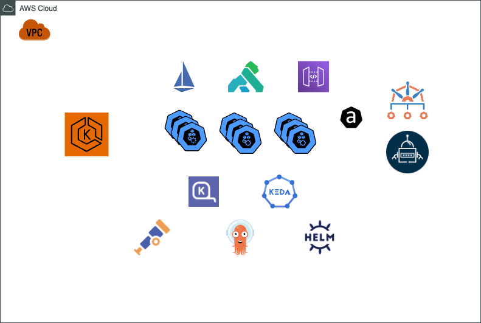

# Material AWS Community Day 2023 - Uruguay

Este repositorio es para alojar las referencias y material de las herramientas mencionadas y que figuran en el diagrama de componentes mas abajo.

* Application Layer
  * Istio - https://istio.io/latest/about/service-mesh/
  * Kong - https://konghq.com/
  * AWS API Gateway - https://aws.amazon.com/es/api-gateway/
* Provisioning Resource
  * Karpenter - https://karpenter.sh/docs/
  * KEDA - https://keda.sh/docs/2.12/concepts/
* Security Layer
  * Kyverno - https://kyverno.io/docs/introduction/
  * External Secret Operator - https://external-secrets.io/latest/
* Management Layer
  * OpenTelemetry - https://opentelemetry.io/docs/what-is-opentelemetry/
  * ArgoCD - https://argo-cd.readthedocs.io/en/stable/
  * Helm - https://helm.sh/docs/intro/quickstart/
* Misc
  * Well-Architected Framework - https://aws.amazon.com/well-architected-tool/
  * AWS Controllers for K8S - https://aws.amazon.com/blogs/containers/aws-controllers-for-kubernetes-ack/

## DEMO: KEDA + Karpenter

